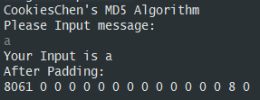
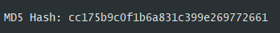
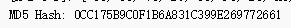
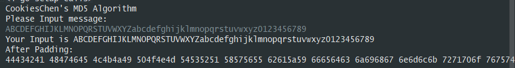
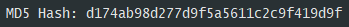
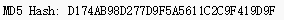

# MD5算法程序设计与实现

本文主要讲述标准MD5算法的程序设计与实现，使用`Golang`语言实现。

[github](https://github.com/CookiesChen/MD5)

## MD5算法原理概述

MD4 (1990)、MD5(1992, RFC 1321) 由 Ron Rivest 发明，是广泛使用的 Hash 算法，用于确保信息传输的完整性和一致性。MD5 使用 little-endian (小端模式)，输入任意不定长度信息，以512-bit 进行分组，生成四个32-bit 数据，最后联合输出固定128-bit 的信息摘要。

## 总体结构

MD5 算法的基本过程为：填充、分块、缓冲区初始化、循环压缩、得出结果。

## 模块分解

根据总体结构进行模块分解。

```go
// 程序结构树
|-main
|-md5
   |-md5
   |-compression
   |-padding
```

本次将程序分为两大部分，一是填充、分块，二是缓冲区初始化、循环压缩。

### 填充

在长度为 K bits 的原始消息数据尾部填充长度为 P bits 的标识100…0，1<=P<= 512 (即至少要填充1bit)，使得填充后的消息位数为：K + P = 448 (mod 512)。注意到当 K = 448 (mod 512) 时，需要 P= 512。再向上述填充好的消息尾部附加 K 值的低64位 (即 K mod 264)，最后得到一个长度位数为 K + P + 64 = 0 (mod 512) 的消息。

本次程序处理的是字符串，因此上述P>=8，具体程序填充的处理思路为，获取输入的字符串，将字符串转成byte[]数组，然后根据上述描述进行填充，填充成所需的byte[]数组之后，接下来需要将每4个byte转换成一个32位的uint32，注意转换的时候需要使用`小端存储`。接下来看代码如何实现的吧。

```go
func padding(input []byte) (message []uint32) {
	K := len(input) * 8
	// 填充P位数据
	P := (448 - (K % 512) + 512) % 512
	if P == 0 {
		P = 512
	}
	input = append(input, byte(128))
	for i,times := 1,P/8; i < times; i++ {
		input = append(input, byte(0))
	}

	// 附加K值的低64位
	b := make([]byte, 8)
	binary.LittleEndian.PutUint64(b, uint64(K))
	input = append(input, b...)

	// 转成uint32数组
	for i,times := 0,len(input)/4; i < times; i++ {
		b := []byte{input[i*4], input[i*4+1], input[i*4+2], input[i*4+3]}
		bytesBuffer := bytes.NewBuffer(b)
		var x uint32
		binary.Read(bytesBuffer, binary.LittleEndian, &x)
		message = append(message, x)
	}

	return message
}
```

### 分块

把填充后的消息结果分割为 L 个 512-bit 分组：Y0, Y1, …, YL-1，分组结果也可表示成 N 个32-bit 字 M0, M1, …, MN-1，N = L*16，因为后续的操作都是针对32位进行的，也可以理解成后面的形式。分块相对比较简单。

### 寄存器初始化

初始化一个128-bit 的 MD 缓冲区，记为 CVq，表示成4个32-bit寄存器 (A, B, C, D)；CV0 = IV。迭代在 MD 缓冲区进行，最后一步的128-bit 输出即为算法结果。

寄存器 (A, B, C, D) 置16进制初值作为初始向量 IV，并采用小端存储 (little-endian) 的存储结构：

A = 0x67452301
B = 0xEFCDAB89
C = 0x98BADCFE
D = 0x10325476

这是最初始的状态，在对一个块进行了循环压缩之前，需要记录下输入进来的寄存器的值AA，BB，CC，DD，在每一块循环压缩之后加上记录下的AA，BB，CC，DD。

### 循环压缩

MD5最核心的部分就是循环压缩，一共分为4轮，以512-bit 消息分组为单位，每一分组 Yq (q = 0, 1, …, L-1) 经过4个循环的压缩算法，表示为：CV0 = IVCVi = HMD5(CVi-1 , Yi)。正如上面寄存器初始化所说的，在对一个块完成4个循环的压缩算法之后，需要加上寄存器初始值，这个值是在该块进行循环压缩的值。

在每一轮循环中，需要进行16次迭代，每次迭代运算逻辑如下：

对A迭代：`a = b + ((a + g(b, c, d) + X[k] + T[i]) << s`

迭代之后需要进行轮转(A,B,C,D) --> (D, A, B, C)，a, b, c, d为MD 缓冲区 (A, B, C, D) 的当前值，g : 轮函数 (F, G, H, I 中的一个)，<<s将32位输入循环左移 (CLS) s 位，X[k] : 当前处理消息分组的第 k 个 (k = 0..15) 32位字，即Mq*16+k，T[i] : T 表的第 i 个元素，32位字；T 表总共有64个元素，也称为加法常数。

**X表**

| 循环轮次 | X表                                              |
| -------- | ------------------------------------------------ |
| 1        | [0, 1, 2, 3, 4, 5, 6, 7, 8, 9,10,11,12,13,14,15] |
| 2        | [1, 6,11, 0, 5,10,15, 4, 9,14, 3, 8,13, 2, 7,12] |
| 3        | [5, 8,11,14, 1, 4, 7,10,13, 0, 3, 6, 9,12,15, 2] |
| 4        | [0, 7,14, 5,12, 3,10, 1, 8,15, 6,13, 4,11, 2, 9] |

**T表**

```
第一轮
T[ 1.. 4] = { 0xd76aa478, 0xe8c7b756, 0x242070db, 0xc1bdceee }
T[ 5.. 8] = { 0xf57c0faf, 0x4787c62a, 0xa8304613, 0xfd469501 }
T[ 9..12] = { 0x698098d8, 0x8b44f7af, 0xffff5bb1, 0x895cd7be }
T[13..16] = { 0x6b901122, 0xfd987193, 0xa679438e, 0x49b40821 }
第二轮
T[17..20] = { 0xf61e2562, 0xc040b340, 0x265e5a51, 0xe9b6c7aa }
T[21..24] = { 0xd62f105d, 0x02441453, 0xd8a1e681, 0xe7d3fbc8 }
T[25..28] = { 0x21e1cde6, 0xc33707d6, 0xf4d50d87, 0x455a14ed }
T[29..32] = { 0xa9e3e905, 0xfcefa3f8, 0x676f02d9, 0x8d2a4c8a } 
第三轮
T[33..36] = { 0xfffa3942, 0x8771f681, 0x6d9d6122, 0xfde5380c }
T[37..40] = { 0xa4beea44, 0x4bdecfa9, 0xf6bb4b60, 0xbebfbc70 }
T[41..44] = { 0x289b7ec6, 0xeaa127fa, 0xd4ef3085, 0x04881d05 }
T[45..48] = { 0xd9d4d039, 0xe6db99e5, 0x1fa27cf8, 0xc4ac5665 }
第四轮
T[49..52] = { 0xf4292244, 0x432aff97, 0xab9423a7, 0xfc93a039 }
T[53..56] = { 0x655b59c3, 0x8f0ccc92, 0xffeff47d, 0x85845dd1 }
T[57..60] = { 0x6fa87e4f, 0xfe2ce6e0, 0xa3014314, 0x4e0811a1 }
T[61..64] = { 0xf7537e82, 0xbd3af235, 0x2ad7d2bb, 0xeb86d391 } 
```

注意每轮取16个，第一轮为1-16，第二轮为17-32....

**S值**

```
第一轮
s[ 1..16] = { 7, 12, 17, 22, 7, 12, 17, 22, 7, 12, 17, 22, 7, 12, 17, 22 }
第二轮
s[17..32] = { 5, 9, 14, 20, 5, 9, 14, 20, 5, 9, 14, 20, 5, 9, 14, 20 }
第三轮
s[33..48] = { 4, 11, 16, 23, 4, 11, 16, 23, 4, 11, 16, 23, 4, 11, 16, 23 }
第三轮
s[49..64] = { 6, 10, 15, 21, 6, 10, 15, 21, 6, 10, 15, 21, 6, 10, 15, 21 }
```

接下来看一下代码实现

```go
package md5

import "fmt"

var(
	X1 = []int{0, 1, 2, 3, 4, 5, 6, 7, 8, 9,10,11,12,13,14,15}
	X2 = []int{1, 6,11, 0, 5,10,15, 4, 9,14, 3, 8,13, 2, 7,12}
	X3 = []int{5, 8,11,14, 1, 4, 7,10,13, 0, 3, 6, 9,12,15, 2}
	X4 = []int{0, 7,14, 5,12, 3,10, 1, 8,15, 6,13, 4,11, 2, 9}

	T = []uint32{
		0xd76aa478, 0xe8c7b756, 0x242070db, 0xc1bdceee,
		0xf57c0faf, 0x4787c62a, 0xa8304613, 0xfd469501,
		0x698098d8, 0x8b44f7af, 0xffff5bb1, 0x895cd7be,
		0x6b901122, 0xfd987193, 0xa679438e, 0x49b40821,
		0xf61e2562, 0xc040b340, 0x265e5a51, 0xe9b6c7aa,
		0xd62f105d, 0x02441453, 0xd8a1e681, 0xe7d3fbc8,
		0x21e1cde6, 0xc33707d6, 0xf4d50d87, 0x455a14ed,
		0xa9e3e905, 0xfcefa3f8, 0x676f02d9, 0x8d2a4c8a,
		0xfffa3942, 0x8771f681, 0x6d9d6122, 0xfde5380c,
		0xa4beea44, 0x4bdecfa9, 0xf6bb4b60, 0xbebfbc70,
		0x289b7ec6, 0xeaa127fa, 0xd4ef3085, 0x04881d05,
		0xd9d4d039, 0xe6db99e5, 0x1fa27cf8, 0xc4ac5665,
		0xf4292244, 0x432aff97, 0xab9423a7, 0xfc93a039,
		0x655b59c3, 0x8f0ccc92, 0xffeff47d, 0x85845dd1,
		0x6fa87e4f, 0xfe2ce6e0, 0xa3014314, 0x4e0811a1,
		0xf7537e82, 0xbd3af235, 0x2ad7d2bb, 0xeb86d391,
	}

	S1 = []uint{ 7, 12, 17, 22, 7, 12, 17, 22, 7, 12, 17, 22, 7, 12, 17, 22 }
	S2 = []uint{ 5, 9, 14, 20, 5, 9, 14, 20, 5, 9, 14, 20, 5, 9, 14, 20}
	S3 = []uint{ 4, 11, 16, 23, 4, 11, 16, 23, 4, 11, 16, 23, 4, 11, 16, 23 }
	S4 = []uint{ 6, 10, 15, 21, 6, 10, 15, 21, 6, 10, 15, 21, 6, 10, 15, 21 }

)

func compression(Y []uint32)  {
	start := make([]uint32, 4)
	for i := 0; i < 4; i++ {
		start[i] = CV[i]
	}
	for i := 0; i < 4; i++ {
		g(Y, i)
	}
	CV[0] += start[0]
	CV[1] += start[1]
	CV[2] += start[2]
	CV[3] += start[3]
}

func g(Y []uint32, times int)  {
	var X []int
	var function func(uint32, uint32, uint32) uint32
	var S []uint
	switch times {
	case 0:
		X = X1
		function = F
		S = S1
		break
	case 1:
		X = X2
		function = G
		S = S2
		break
	case 2:
		X = X3
		function = H
		S = S3
		break
	case 3:
		X = X4
		function = I
		S = S4
		break
	}
	for i := 0; i < 16; i++ {
		a, b, c, d := CV[0], CV[1], CV[2], CV[3]
		CV[1] = b + CLS(a + function(b, c, d) +  Y[X[i]] + T[times*16 + i], S[i])
		CV[0], CV[2], CV[3] = d, b, c
		fmt.Printf("%x %x %x %x\n", CV[0],CV[1],CV[2],CV[3])
	}

}

func F(b, c, d uint32) uint32 {
	return (b&c)|((^b)&d)
}

func G(b, c, d uint32) uint32 {
	return (b&d)|(c&(^d))
}

func H(b, c, d uint32) uint32 {
	return b^c^d
}

func I(b, c, d uint32) uint32 {
	return c^(b|(^d))
}

func CLS(num uint32, bitNum uint) uint32 {
	high, low := num, num
	high = high << bitNum
	low = low >> (32 - bitNum)
	return high + low
}
```

程序实现的时候，传入了一个循环轮次`i`，通过轮次，确定具体的X表值、轮函数和S值，按照上面描述的运算逻辑，这里需要注意的是循环左移，假设左移的位数为s，这里处理的方法是，先把原来的数左移s位，注意此时只是普通左移，再讲原来的数右移32-s位，取出原来的数最高的s位，普通左移s位后的数字相加，就是循环左移的结果。另一点需要注意的就是，需要记录寄存器CV的初始值，因为在做完16次迭代之后，需要使用到。

### 得到结果

将分块后的块逐个进行循环压缩，得出的寄存器内的值，注意此时使用的小端存储，如果想要输出显示，需要转换成大端存储才能显示，具体代码如下：

```go
for i := 0; i < 4; i++ {
    b := make([]byte, 8)
    binary.LittleEndian.PutUint32(b, output[i])
    bytesBuffer := bytes.NewBuffer(b)
    binary.Read(bytesBuffer, binary.BigEndian, &output[i])
    fmt.Printf("%x", output[i])
}
```

## 数据结构

本次实验使用的数据结构如下：

* 数组：用于存储各种表值，数据块以及寄存器值。

## 程序运行结果

程序接收的输入为不含`空格`的字符串

结果正确性验证使用[网站]([md5的debug](https://rosettacode.org/wiki/MD5/Implementation_Debug))

**测试1：a**



可以看到填充后的16进制数据为：

```
8061 0 0 0 0 0 0 0 0 0 0 0 0 0 8 0
```

循环压缩过程中寄存器中的值：

```
Block 0:
10325476 a56017f4 efcdab89 98badcfe
98badcfe f2d58361 a56017f4 efcdab89
efcdab89 e65857a7 f2d58361 a56017f4
a56017f4 607d9686 e65857a7 f2d58361
f2d58361 3a9d5bcc 607d9686 e65857a7
e65857a7 e0a07db7 3a9d5bcc 607d9686
607d9686 d31ddc83 e0a07db7 3a9d5bcc
3a9d5bcc a8af6da5 d31ddc83 e0a07db7
e0a07db7 be580957 a8af6da5 d31ddc83
d31ddc83 f386bea6 be580957 a8af6da5
a8af6da5 f5fdd933 f386bea6 be580957
be580957 68493d6a f5fdd933 f386bea6
f386bea6 44244cf8 68493d6a f5fdd933
f5fdd933 d0fe9b27 44244cf8 68493d6a
68493d6a 6360a45f d0fe9b27 44244cf8
44244cf8 f01e3ce2 6360a45f d0fe9b27
d0fe9b27 9c341767 f01e3ce2 6360a45f
6360a45f 970ab3a9 9c341767 f01e3ce2
f01e3ce2 e39ffd23 970ab3a9 9c341767
9c341767 8d25cc66 e39ffd23 970ab3a9
970ab3a9 8c444930 8d25cc66 e39ffd23
e39ffd23 7267097a 8c444930 8d25cc66
8d25cc66 2dacb8a3 7267097a 8c444930
8c444930 373beab0 2dacb8a3 7267097a
7267097a f175e3ad 373beab0 2dacb8a3
2dacb8a3 9d5df67e f175e3ad 373beab0
373beab0 87b7f475 9d5df67e f175e3ad
f175e3ad c8f891b4 87b7f475 9d5df67e
9d5df67e 93842e98 c8f891b4 87b7f475
87b7f475 c7043b64 93842e98 c8f891b4
c8f891b4 94a2ebee c7043b64 93842e98
93842e98 3745961f 94a2ebee c7043b64
c7043b64 bd607d1e 3745961f 94a2ebee
94a2ebee a6f72085 bd607d1e 3745961f
3745961f bf8b4f98 a6f72085 bd607d1e
bd607d1e daf7f308 bf8b4f98 a6f72085
a6f72085 35a82a7a daf7f308 bf8b4f98
bf8b4f98 89e0ec97 35a82a7a daf7f308
daf7f308 5abe099c 89e0ec97 35a82a7a
35a82a7a cf7e60db 5abe099c 89e0ec97
89e0ec97 75c151e2 cf7e60db 5abe099c
5abe099c 942e0c86 75c151e2 cf7e60db
cf7e60db c0e6ac4 942e0c86 75c151e2
75c151e2 cc6f5e9e c0e6ac4 942e0c86
942e0c86 ac50e18 cc6f5e9e c0e6ac4
c0e6ac4 79ca7845 ac50e18 cc6f5e9e
cc6f5e9e 8a4a6356 79ca7845 ac50e18
ac50e18 918f93bb 8a4a6356 79ca7845
79ca7845 cab8fe42 918f93bb 8a4a6356
8a4a6356 6a4daeee cab8fe42 918f93bb
918f93bb 36269c3f 6a4daeee cab8fe42
cab8fe42 1ee405eb 36269c3f 6a4daeee
6a4daeee 982c7861 1ee405eb 36269c3f
36269c3f 6812a362 982c7861 1ee405eb
1ee405eb 71fc7709 6812a362 982c7861
982c7861 893501c0 71fc7709 6812a362
6812a362 febd62fd 893501c0 71fc7709
71fc7709 28936a74 febd62fd 893501c0
893501c0 53e33526 28936a74 febd62fd
febd62fd aa4d8ae3 53e33526 28936a74
28936a74 52309e0b aa4d8ae3 53e33526
53e33526 50f422f3 52309e0b aa4d8ae3
aa4d8ae3 49dee633 50f422f3 52309e0b
52309e0b b8e94637 49dee633 50f422f3
```

最后输出的结果如下：



与下面md5的debug工具比较之后，结果一致。



**测试2：ABCDEFGHIJKLMNOPQRSTUVWXYZabcdefghijklmnopqrstuvwxyz0123456789**



填充之后数组为：

```
44434241 48474645 4c4b4a49 504f4e4d 54535251 58575655 62615a59 66656463 6a696867 6e6d6c6b 7271706f 76757473 7a797877 33323130 37363534 803938 0 0 0 0 0 0 0 0 0 0 0 0 0 0 1f0 0 
```

循环压缩过程中寄存器中的值：

```
Block 0:
10325476 c6c10796 efcdab89 98badcfe
98badcfe 99a09999 c6c10796 efcdab89
efcdab89 11067980 99a09999 c6c10796
c6c10796 27bce07a 11067980 99a09999
99a09999 f22e6c4e 27bce07a 11067980
11067980 b4ac9218 f22e6c4e 27bce07a
27bce07a a95a2fc0 b4ac9218 f22e6c4e
f22e6c4e a4799506 a95a2fc0 b4ac9218
b4ac9218 1eb3e7c1 a4799506 a95a2fc0
a95a2fc0 a6e70cfe 1eb3e7c1 a4799506
a4799506 ca27520b a6e70cfe 1eb3e7c1
1eb3e7c1 8a7612ec ca27520b a6e70cfe
a6e70cfe 3cbdcd45 8a7612ec ca27520b
ca27520b b8dec763 3cbdcd45 8a7612ec
8a7612ec fa148c8a b8dec763 3cbdcd45
3cbdcd45 5d38e690 fa148c8a b8dec763
b8dec763 4b9d52a 5d38e690 fa148c8a
fa148c8a 783002eb 4b9d52a 5d38e690
5d38e690 d3ee3ed1 783002eb 4b9d52a
4b9d52a 47ae7c81 d3ee3ed1 783002eb
783002eb 2d7d8a3f 47ae7c81 d3ee3ed1
d3ee3ed1 d1210823 2d7d8a3f 47ae7c81
47ae7c81 4b534dc3 d1210823 2d7d8a3f
2d7d8a3f 75292030 4b534dc3 d1210823
d1210823 9d2a6e33 75292030 4b534dc3
4b534dc3 e8d2e44 9d2a6e33 75292030
75292030 d473b564 e8d2e44 9d2a6e33
9d2a6e33 f2ff6ea0 d473b564 e8d2e44
e8d2e44 9b085fa9 f2ff6ea0 d473b564
d473b564 4400a9bd 9b085fa9 f2ff6ea0
f2ff6ea0 5993248f 4400a9bd 9b085fa9
9b085fa9 dd789ecc 5993248f 4400a9bd
4400a9bd 21c8d2b7 dd789ecc 5993248f
5993248f 1d55a18e 21c8d2b7 dd789ecc
dd789ecc 56ec119 1d55a18e 21c8d2b7
21c8d2b7 1b9504f8 56ec119 1d55a18e
1d55a18e 436b7fe9 1b9504f8 56ec119
56ec119 75800c1 436b7fe9 1b9504f8
1b9504f8 f404c2f6 75800c1 436b7fe9
436b7fe9 cf0341ed f404c2f6 75800c1
75800c1 888e7d8a cf0341ed f404c2f6
f404c2f6 bbdaecd8 888e7d8a cf0341ed
cf0341ed ce620273 bbdaecd8 888e7d8a
888e7d8a 47b9419 ce620273 bbdaecd8
bbdaecd8 2dbee21d 47b9419 ce620273
ce620273 e95c3a43 2dbee21d 47b9419
47b9419 ee46e961 e95c3a43 2dbee21d
2dbee21d f166f514 ee46e961 e95c3a43
e95c3a43 e47fd4f3 f166f514 ee46e961
ee46e961 fb887751 e47fd4f3 f166f514
f166f514 f22aedcc fb887751 e47fd4f3
e47fd4f3 7a13bc5c f22aedcc fb887751
fb887751 a691d430 7a13bc5c f22aedcc
f22aedcc 528452f2 a691d430 7a13bc5c
7a13bc5c 3fc23df6 528452f2 a691d430
a691d430 efb0e72f 3fc23df6 528452f2
528452f2 27145703 efb0e72f 3fc23df6
3fc23df6 21a11069 27145703 efb0e72f
efb0e72f 374fbe79 21a11069 27145703
27145703 49d9a5b4 374fbe79 21a11069
21a11069 1cb80f0a 49d9a5b4 374fbe79
374fbe79 ea3d3eb4 1cb80f0a 49d9a5b4
49d9a5b4 10f68731 ea3d3eb4 1cb80f0a
1cb80f0a ef2e3a46 10f68731 ea3d3eb4
Block 1:
fa6f932a eda23ed1 defbe5cf a9b1642f
a9b1642f 989939cf eda23ed1 defbe5cf
defbe5cf 3c307338 989939cf eda23ed1
eda23ed1 ddcf0634 3c307338 989939cf
989939cf 75144433 ddcf0634 3c307338
3c307338 c8875807 75144433 ddcf0634
ddcf0634 c783cb60 c8875807 75144433
75144433 99b6b699 c783cb60 c8875807
c8875807 a60a3f69 99b6b699 c783cb60
c783cb60 aa6630be a60a3f69 99b6b699
99b6b699 64db26e9 aa6630be a60a3f69
a60a3f69 64cc7c5a 64db26e9 aa6630be
aa6630be a70737da 64cc7c5a 64db26e9
64db26e9 5473f8a7 a70737da 64cc7c5a
64cc7c5a 96f6586e 5473f8a7 a70737da
a70737da a36f556f 96f6586e 5473f8a7
5473f8a7 a5050ad3 a36f556f 96f6586e
96f6586e 28776046 a5050ad3 a36f556f
a36f556f 27dcd8b4 28776046 a5050ad3
a5050ad3 82b8827c 27dcd8b4 28776046
28776046 e04f070c 82b8827c 27dcd8b4
27dcd8b4 2f3cd2a2 e04f070c 82b8827c
82b8827c c0d22b61 2f3cd2a2 e04f070c
e04f070c df35cb56 c0d22b61 2f3cd2a2
2f3cd2a2 242dd210 df35cb56 c0d22b61
c0d22b61 576ace33 242dd210 df35cb56
df35cb56 5c295967 576ace33 242dd210
242dd210 2291191a 5c295967 576ace33
576ace33 24eba695 2291191a 5c295967
5c295967 4bd0378b 24eba695 2291191a
2291191a 10c42a2f 4bd0378b 24eba695
24eba695 9c03e2e8 10c42a2f 4bd0378b
4bd0378b 5be1d526 9c03e2e8 10c42a2f
10c42a2f 9e414279 5be1d526 9c03e2e8
9c03e2e8 9f4a1a7e 9e414279 5be1d526
5be1d526 a2448453 9f4a1a7e 9e414279
9e414279 e14e403d a2448453 9f4a1a7e
9f4a1a7e e8cfd670 e14e403d a2448453
a2448453 60cc183a e8cfd670 e14e403d
e14e403d fe314121 60cc183a e8cfd670
e8cfd670 fff62809 fe314121 60cc183a
60cc183a e37209ac fff62809 fe314121
fe314121 8cb5221c e37209ac fff62809
fff62809 7c7e974c 8cb5221c e37209ac
e37209ac 54c9eb3a 7c7e974c 8cb5221c
8cb5221c d4d9c6ac 54c9eb3a 7c7e974c
7c7e974c 2ec86f72 d4d9c6ac 54c9eb3a
54c9eb3a 79c0710a 2ec86f72 d4d9c6ac
d4d9c6ac 2095af1 79c0710a 2ec86f72
2ec86f72 13d245fd 2095af1 79c0710a
79c0710a a8dcfe26 13d245fd 2095af1
2095af1 2ba98e3f a8dcfe26 13d245fd
13d245fd e126c1aa 2ba98e3f a8dcfe26
a8dcfe26 96b00fa7 e126c1aa 2ba98e3f
2ba98e3f 6f287ff5 96b00fa7 e126c1aa
e126c1aa fb7bcee0 6f287ff5 96b00fa7
96b00fa7 452c1099 fb7bcee0 6f287ff5
6f287ff5 ca801ba6 452c1099 fb7bcee0
fb7bcee0 c197ea8e ca801ba6 452c1099
452c1099 5ac74608 c197ea8e ca801ba6
ca801ba6 14ae42c6 5ac74608 c197ea8e
c197ea8e a52dae75 14ae42c6 5ac74608
5ac74608 826afd76 a52dae75 14ae42c6
14ae42c6 16dd9203 826afd76 a52dae75
```

最后输出结果：



与下面md5的debug工具比较之后，结果一致。



**实验结论**：成功实现MD5算法。